# Ahara Processing: Complete Connected System

## 1. System Architecture (How Everything Connects)

This topology diagram shows the physical and logical connections between all components.

```mermaid
graph TD
    %% Nodes
    User([👤 Customer Phone])
    WA[☁️ WhatsApp Business Cloud]
    Server[🚀 Ahara Backend Server]
    OpenAI[🧠 OpenAI model]
    DB[(🗄️ SQLite Database)]
    Admin([💻 Admin Dashboard])

    %% Flows
    User -- "1. Sends Message" --> WA
    WA -- "2. Webhook (POST)" --> Server

    subgraph "Ahara Internal Network (Secure)"
        Server -- "3. Analyze Intent" --> OpenAI
        OpenAI -- "4. JSON Data" --> Server

        Server -- "5. Check/Save Data" --> DB
        DB -- "6. Return Slots" --> Server

        Admin -- "7. View/Manage" --> Server
    end

    Server -- "8. Reply Text" --> WA
    WA -- "9. Deliver msg" --> User

    %% Styling
    style User fill:#f9f,stroke:#333
    style Admin fill:#bbf,stroke:#333
    style Server fill:#bfb,stroke:#333
```

## 2. Conversation Flow (The Logic Loop)

This chart traces the decision steps for a **"Freeze Drying"** booking.

```mermaid
sequenceDiagram
    participant User as 👤 Customer
    participant Bot as 🤖 Ahara Bot
    participant Server as 🚀 Server Logic
    participant DB as 🗄️ Database

    User->>Bot: "I want to book"
    Bot->>User: "Which service? (Retort, Freeze Drying...)"

    User->>Bot: "Freeze Drying"
    Note right of Server: Constraint 1: Product Type
    Bot->>User: "What product? (e.g. Mangoes)"

    User->>Bot: "Ripe Jackfruit"
    Note right of Server: Constraint 2: Quantity
    Bot->>User: "What is the total quantity?"

    User->>Bot: "200 kg"
    Bot->>User: "When would you like to book?"

    User->>Bot: "Tomorrow Morning"

    rect rgb(255, 250, 240)
        Note right of Server: Constraint 3: Check Available Slots
        Server->>DB: Check Bookings (Time=Tomorrow, Qty=200kg)
        DB-->>Server: Slots Available at 10 AM, 2 PM
    end

    Bot->>User: "Slots for 200kg:\n1. 10:00 AM\n2. 02:00 PM"

    User->>Bot: "1"
    Server->>DB: INSERT INTO bookings ...
    Bot->>User: "✅ Confirmed! 200kg Jackfruit reserved for 10 AM."
```

## 3. Data Flow

1.  **Input**: "I have 500kg of Tuna for Retort."
2.  **Server Parsing**: `Service="Retort"`, `Quantity="500kg"`, `Product="Tuna"`.
3.  **Storage**: `INSERT INTO bookings (service, quantity, product_type) VALUES (...)`
4.  **Admin View**: Manager sees "500kg Tuna" on the Dashboard.
