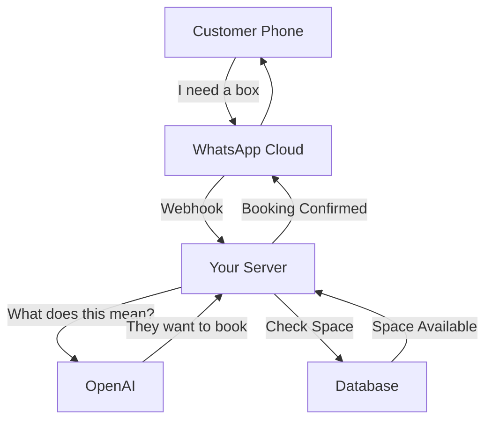

# How It Works in Production (The Lifecycle of a Message)

Here is the step-by-step journey of a message when the system is live. You can explain this to your friend.

### 1. The Trigger (User's Phone) 📱

- **Action**: A customer sends a message on WhatsApp: _"I want to book freeze drying for 50kg mangoes"_.
- **Path**: The message travels from their phone -> **Meta's Cloud Servers**.

### 2. The Messenger (Meta Webhook) ⚡

- **Meta's Role**: Facebook/Meta receives the message.
- **Webhook**: It looks up your "Callback URL" (the Railway link) and sends a `POST` request to `https://ahara-production.up.railway.app/webhook`.
- **Payload**: This request contains the phone number, message ID, and the text body.

### 3. The Brain (Your Railway Server) 🧠

- **Reception**: Your Node.js server (running on Railway) receives the request at `routes/webhook.js`.
- **Processing**:
  1.  It checks the user's "State" (Are they new? Are they answering a question?).
  2.  It constructs a **Prompt** for the AI.
  3.  **API Call**: It sends the text to **Google Gemini API** (`services/llm.js`).

### 4. The Intelligence (Google Gemini) 🤖

- **Analysis**: Gemini analyzes the text: _"Intent: INFORM_DETAILS, Product: Mangoes, Qty: 50kg"_.
- **Response**: It returns this structured data back to your server.: _"User wants to **CREATE_BOOKING** for **DATE: TOMORROW**."_

### 4. The Logic (Database)

- **Action**: Our Server now knows what to do. It checks the **Database**.

### 5. The Reply

- **Action**: Our Server constructs a reply: _"Booking confirmed for tomorrow! Ref #101"_.
- **Transfer**: It hands this message back to **WhatsApp**.
- **Delivery**: WhatsApp delivers it to the customer's phone.

---

### Summary Diagram

