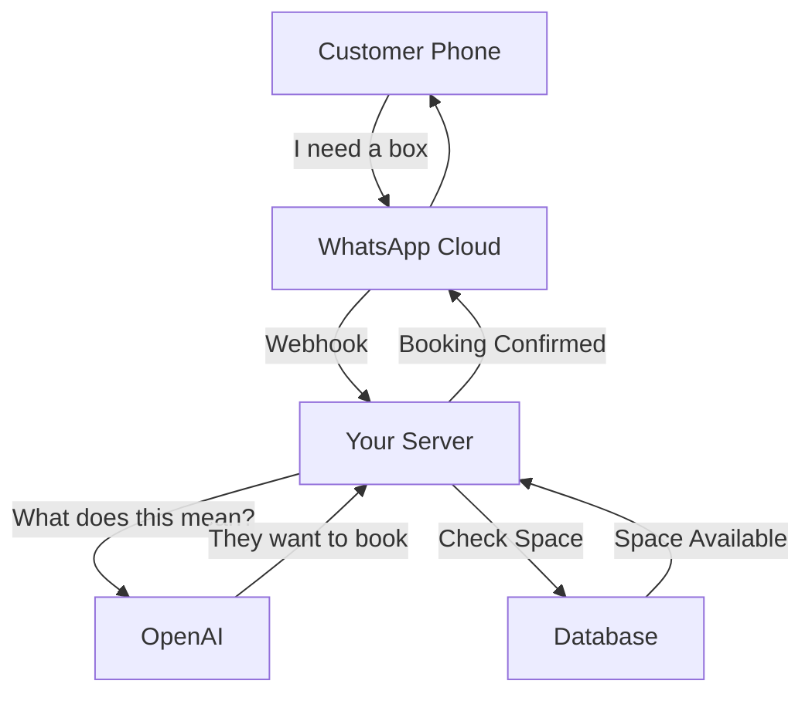

# How It Works in Production (The Lifecycle of a Message)

Here is the step-by-step journey of a message when the system is live. You can explain this to your friend.

### 1. The User Speaks

- **Action**: A customer opens WhatsApp and types: _"I need a frozen box for tomorrow."_
- **Role**: This happens on the customer's phone.

### 2. The Messenger (WhatsApp Cloud)

- **Action**: WhatsApp receives the text. It sees it was sent to your **Business Phone Number**.
- **Transfer**: It instantly forwards this text to our **Server** (Public URL) via a "Webhook".
- _Think of this as the postman traversing the internet to knock on our door._

### 3. The Brain (OpenAI)

- **Action**: Our Server gets the text but doesn't understand "intent" yet. It forwards the text to **OpenAI**.
- **Processing**: OpenAI analyzes _"I need a frozen box for tomorrow"_.
- **Result**: It tells our Server: _"User wants to **CREATE_BOOKING** for **DATE: TOMORROW**."_

### 4. The Logic (Database)

- **Action**: Our Server now knows what to do. It checks the **Database**.
- **Check**: _"Do we have space tomorrow?"_ -> **YES**.
- **Save**: It creates a booking record in the system.

### 5. The Reply

- **Action**: Our Server constructs a reply: _"Booking confirmed for tomorrow! Ref #101"_.
- **Transfer**: It hands this message back to **WhatsApp**.
- **Delivery**: WhatsApp delivers it to the customer's phone.

---

### Summary Diagram

