# Frozen Box Assistant (Ahara Processing) ❄️📦

A WhatsApp-based AI assistant for booking food processing services (Retort, Freeze Drying, etc.). This bot acts as a digital employee, handling customer inquiries, checking availability, and confirming bookings 24/7.

## 🌟 Features

- **AI-Powered Intent Recognition**: Uses Google Gemini to understand natural language (e.g., "I have 50kg of mangoes" -> `Product: Mangoes`, `Qty: 50kg`).
- **State Machine Flow**: Manages conversation context (Service Selection -> Details -> Time -> Confirmation).
- **WhatsApp Integration**: Connects via Meta's Cloud API for scalable messaging.
- **Slot Management**: Checks database for available time slots before confirming.
- **Admin Dashboard**: Simple API endpoints for managers to view bookings and stats.

---

## 🏗️ Architecture

### System Topology

```mermaid
graph TD
    User([👤 Customer]) -- WhatsApp --> WA[☁️ Meta Cloud]
    WA -- Webhook --> Server[🚀 Node.js Server]
    Server -- Intent Analysis --> AI[🧠 Google Gemini]
    Server -- Data --> DB[(🗄️ SQLite/Postgres)]
```



### Data Flow

1.  **User**: "I need to book freeze drying."
2.  **Server**: Receives webhook -> Asks AI to interpret intent.
3.  **AI**: Returns `intent: CREATE_BOOKING`.
4.  **Server**: Checks DB for services -> Asks user for details.
5.  **...Process continues...**
6.  **Server**: `INSERT INTO bookings` -> Sends confirmation to User.

---

## 🛠️ Setup & Installation

### Prerequisites

- Node.js (v18+)
- WhatsApp Business Account (Meta Developers)
- Google Cloud Account (for Gemini API)

### 1. Clone & Install

```bash
git clone https://github.com/samah3303/aahara.git
cd aahara
npm install
```

### 2. Environment Variables

Create a `.env` file in the root directory:

```env
# Server
PORT=3000

# Google Gemini (Intelligence)
# Get key: https://aistudio.google.com/app/apikey
GEMINI_API_KEY=AIzaSy...

# WhatsApp (Communication)
# Get from Meta App Dashboard -> WhatsApp -> API Setup
WHATSAPP_TOKEN=EAA...
WHATSAPP_PHONE_ID=123456789...
VERIFY_TOKEN=ahara_secure_token_2025
```

### 3. Run Locally

```bash
# Start the server
npm start

# For development (auto-restart)
npm run dev
```

---

## 🚀 Deployment (Production)

### 1. Hosting

Deploy to **Railway** or **Render**:

1.  Push code to GitHub.
2.  Create new project on Railway/Render -> Connect Repo.
3.  **Critical**: Add all variables from `.env` to the specific "Environment Variables" section in your host's dashboard.

### 2. Webhook Configuration

1.  Get your public URL (e.g., `https://ahara-bot.up.railway.app`).
2.  Go to **Meta Developers** -> WhatsApp -> Configuration.
3.  Set Webhook URL: `https://your-app-url.com/webhook`.
4.  Verify Token: `ahara_secure_token_2025`.

---

## 🔌 API Endpoints

### Booking & Webhook

- `POST /webhook`: Main entry point for WhatsApp messages.
- `GET /webhook`: Verification endpoint for Meta.

### Client API (for Mobile/Web App)

- `GET /api/centers?pincode=673`: Search processing centers.
- `GET /api/centers/:id`: Get center details.
- `GET /api/users/:phone/bookings`: List user bookings.

### Admin API

- `GET /api/admin/bookings`: View all bookings.
- `GET /api/admin/stats`: View revenue and usage stats.

---

## 📁 Project Structure

- `server.js`: Main entry point.
- `routes/webhook.js`: Core logic for WhatsApp state machine.
- `services/llm.js`: Interface with Google Gemini API.
- `config/database.js`: SQLite connection wrappers.
- `models/schema.js`: Database table definitions.

---

## 🧪 Testing

### Verify WhatsApp Config

```bash
node verify_whatsapp.js
```

### Simulate Flow

```bash
node test_flow.js
```

This script acts as a fake WhatsApp server to test the conversation flow locally.
