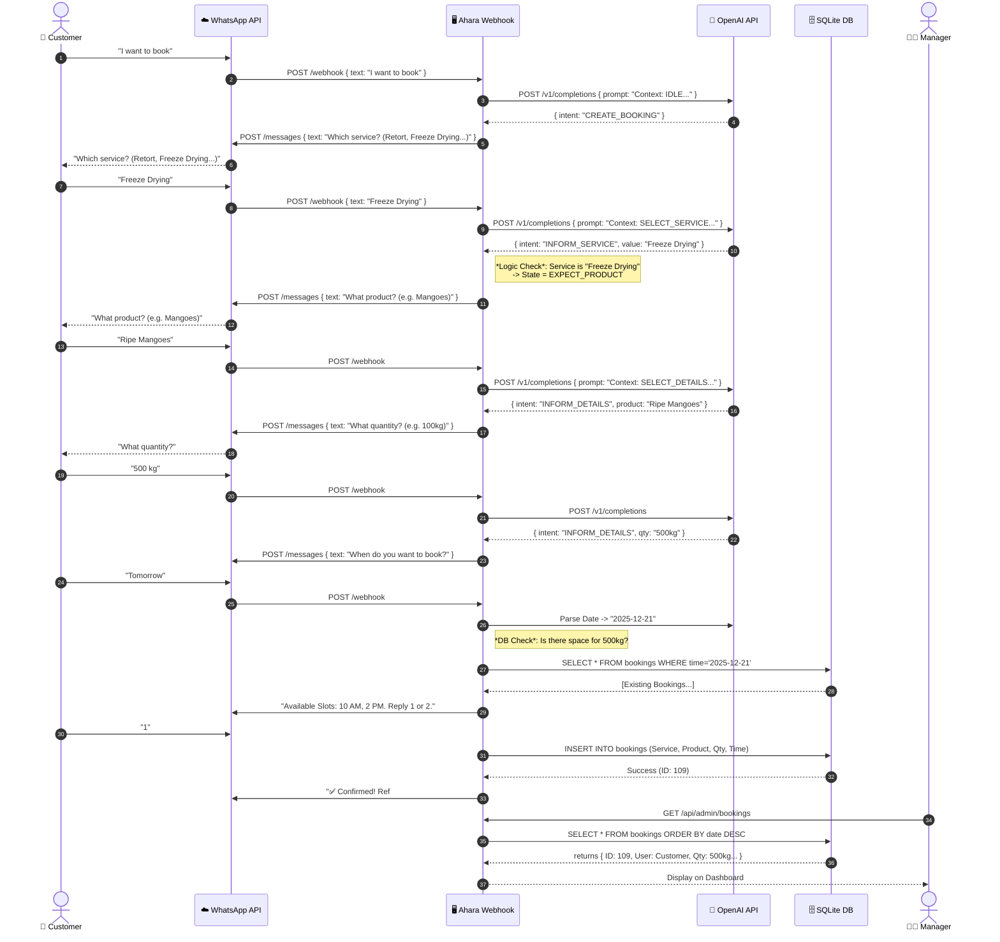

# Technical Sequence Diagram

This diagram details the exact Message/API flow for a **Freeze Drying** booking.

```mermaid
sequenceDiagram
    autonumber

    actor User as 📱 Customer
    participant WA as ☁️ WhatsApp API
    participant Server as 🖥️ Ahara Webhook
    participant LLM as 🧠 OpenAI API
    participant DB as 🗄️ SQLite DB
    actor Admin as 👨‍💼 Manager

    %% --- Step 1: Initiation ---
    User->>WA: "I want to book"
    WA->>Server: POST /webhook { text: "I want to book" }
    Server->>LLM: POST /v1/completions { prompt: "Context: IDLE..." }
    LLM-->>Server: { intent: "CREATE_BOOKING" }
    Server->>WA: POST /messages { text: "Which service? (Retort, Freeze Drying...)" }
    WA-->>User: "Which service? (Retort, Freeze Drying...)"

    %% --- Step 2: Product & Quantity Loop ---
    User->>WA: "Freeze Drying"
    WA->>Server: POST /webhook { text: "Freeze Drying" }
    Server->>LLM: POST /v1/completions { prompt: "Context: SELECT_SERVICE..." }
    LLM-->>Server: { intent: "INFORM_SERVICE", value: "Freeze Drying" }

    Note right of Server: *Logic Check*: Service is "Freeze Drying"<br/>-> State = EXPECT_PRODUCT

    Server->>WA: POST /messages { text: "What product? (e.g. Mangoes)" }
    WA-->>User: "What product? (e.g. Mangoes)"

    User->>WA: "Ripe Mangoes"
    WA->>Server: POST /webhook
    Server->>LLM: POST /v1/completions { prompt: "Context: SELECT_DETAILS..." }
    LLM-->>Server: { intent: "INFORM_DETAILS", product: "Ripe Mangoes" }

    Server->>WA: POST /messages { text: "What quantity? (e.g. 100kg)" }
    WA-->>User: "What quantity?"

    User->>WA: "500 kg"
    WA->>Server: POST /webhook
    Server->>LLM: POST /v1/completions
    LLM-->>Server: { intent: "INFORM_DETAILS", qty: "500kg" }
    Server->>WA: POST /messages { text: "When do you want to book?" }

    %% --- Step 3: Slot Check & Booking ---
    User->>WA: "Tomorrow"
    WA->>Server: POST /webhook
    Server->>LLM: Parse Date -> "2025-12-21"

    Note right of Server: *DB Check*: Is there space for 500kg?
    Server->>DB: SELECT * FROM bookings WHERE time='2025-12-21'
    DB-->>Server: [Existing Bookings...]

    Server->>WA: "Available Slots: 10 AM, 2 PM. Reply 1 or 2."
    User->>WA: "1"

    Server->>DB: INSERT INTO bookings (Service, Product, Qty, Time)
    DB-->>Server: Success (ID: 109)
    Server->>WA: "✅ Confirmed! Ref #109"

    %% --- Step 4: Admin View ---
    Admin->>Server: GET /api/admin/bookings
    Server->>DB: SELECT * FROM bookings ORDER BY date DESC
    DB-->>Server: returns { ID: 109, User: Customer, Qty: 500kg... }
    Server-->>Admin: Display on Dashboard
```
